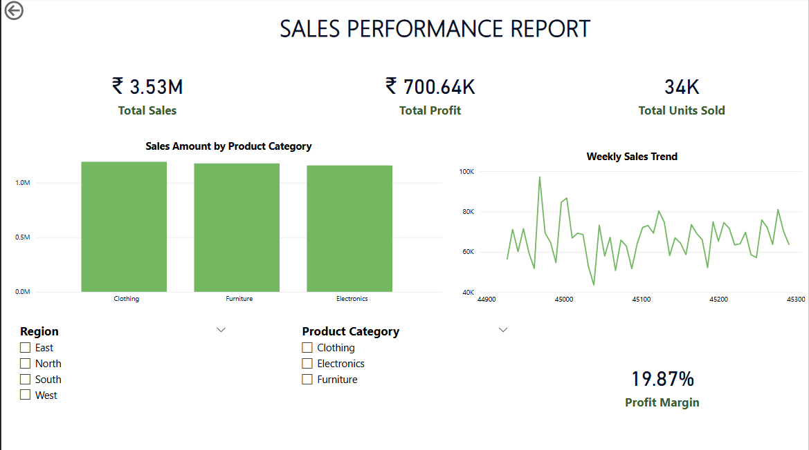

# sales-dashboard0-powerbi
# 📊 Power BI Sales Performance Dashboard
An interactive Power BI dashboard to analyze weekly sales across regions and product categories. This project showcases clean data visualization, KPI tracking, and DAX-based metrics using mock sales data.
---
## 🔧 Features
- Key KPIs: Total Sales, Total Profit, Units Sold
- Trend analysis via line chart
- Custom DAX measure: Profit Margin
- Slicers: Region and Product Category
- Clean, responsive layout
---
## 📁 Files
- `C:\Users\PC\Desktop\powerbi\dashboard0` – Power BI report
- `C:\Users\PC\Desktop\powerbi\Sales_Data_PowerBI` – dataset
– Screenshot 

- ---
## 🚀 How to Use
1. Download both `.pbix` and `.xlsx` files.
2. Keep them in the same folder.
3. Open `Sales_Dashboard.pbix` in [Power BI Desktop](https://powerbi.microsoft.com/en-us/desktop/).

